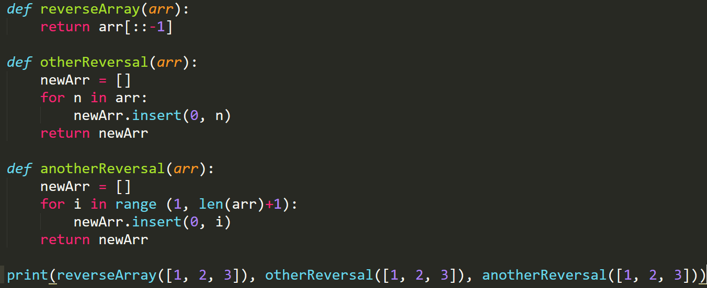

# Reverse an Array

## Challenge
Reverse the items in an array without using native tools liek reverse()

## Approach & Efficiency
We produced 3 potential solutions, a Pythonic for each loop as well as a for i in range... loop that insert into a new array and then lastly a return of arr in coutned order from back to front with [::-1]

## Solution

