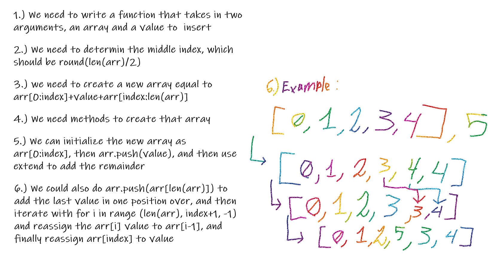

# Shift an Array

## Challenge
Create a function to insert a new value into the middle position of an array without using insert

## Approach & Efficiency
We started off with identifying the index to place the new value at and used round(len(arr)/2) as a way to get a whole number centered on the array, and then we came up with a couple ways to insert and shift. In one case start off by creating a new array with values of arr[0:index], then arr.push(value), and lastly use the extend method to add arr[index, len(arr)]. In the other case we start by doing arr.push(arr[len{arr)]) to add the last value to its new location, then iterate backwards from the end to the index and reassign the values as arr[i]=arr[i-1], and lastly assign arr[index] = value

## Solution

