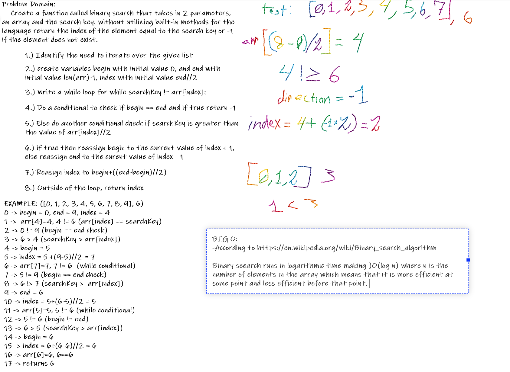

# Binary Search / Half Interval Search

## Challenge
Use the half-interval method to find an element in a sorted list in fewer steps then a linear movement.

## Approach & Efficiency
We started by recoginizing that we would need to identify a center index and then do a while loop to loop indefinitely based on a conditional. We made the conditional searchKey not equal to the current index value of the list. Then we struggled over how to iteratively adjust the index for awhile until we came up with declaring initial being and end values and then adjusting those to the side of the index based on a greter than conditional check and then basing the new index off the being and end values
The efficiency in Big O terms is O(log n)

## Solution

